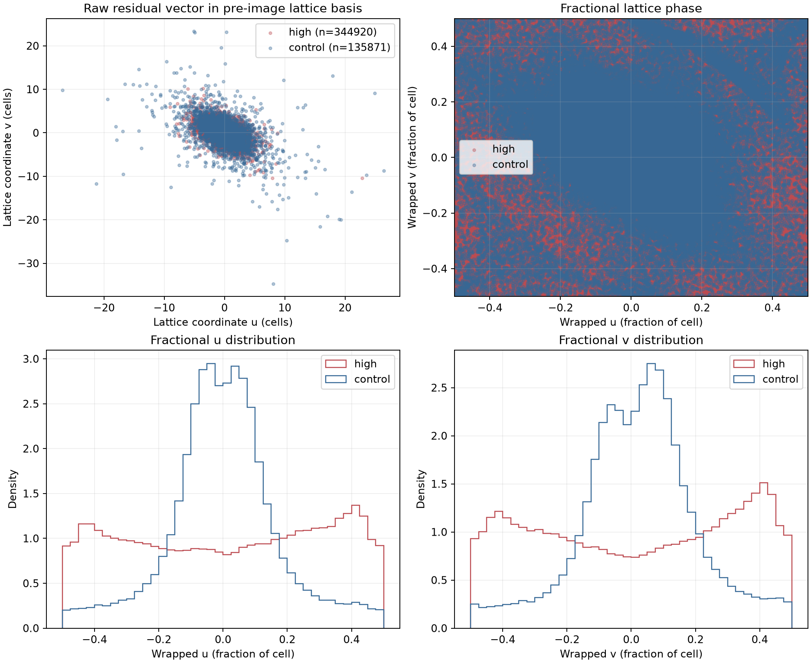
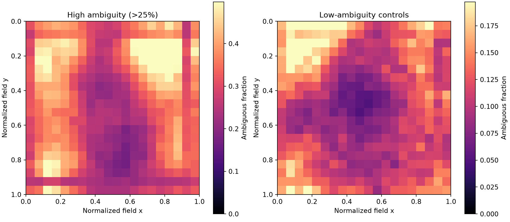
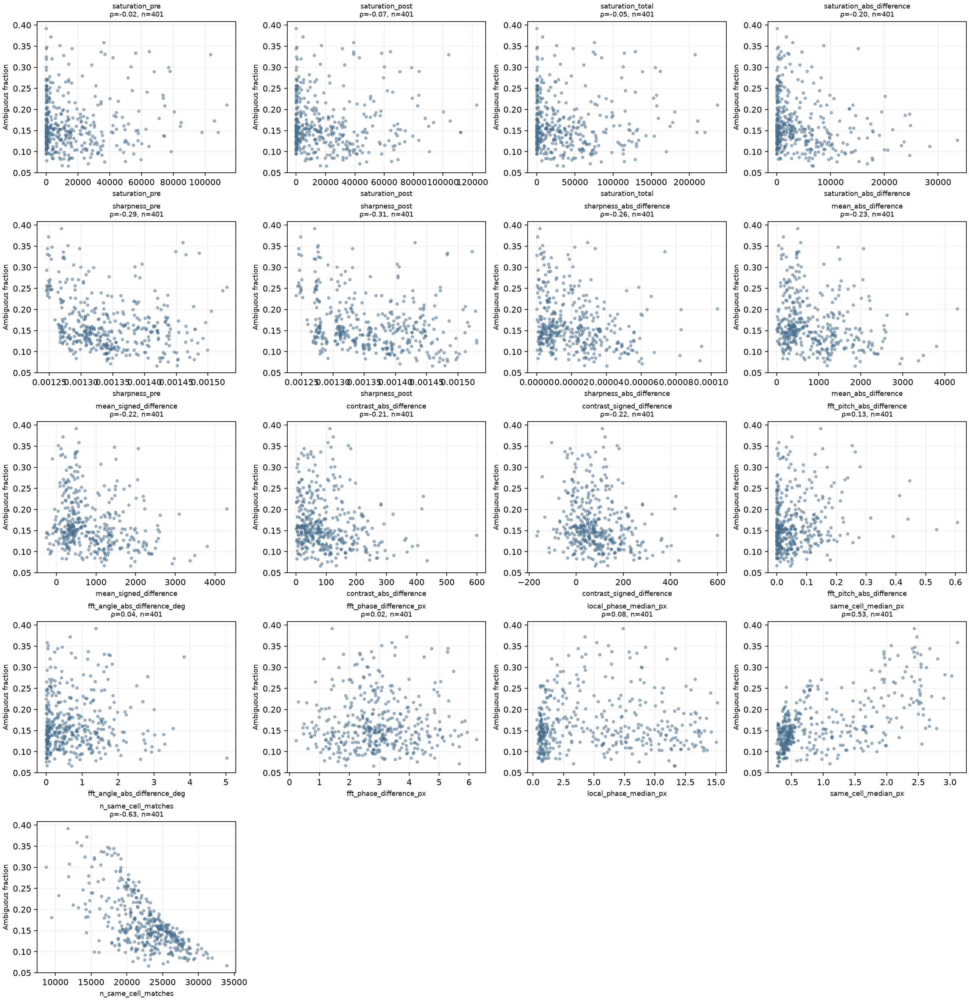

# v21 曖昧対応率が高い視野の原因診断

## 要約

v17の現行標準変換と独立検出中心の対応を用いた401視野のうち、半ピッチ（3.643ピクセル）を超える対応率が25%を超えた視野は47でした。全対応に占める割合は1,762,703 / 10,778,565 = 16.35%で、最大視野率は39.19%、50%を超える視野はありません。

高率47視野の残差は、格子基底上の同じセル移動や一定の分数位相へ集中していません。残差の空間的な一次変化も、どの視野でも残差エネルギーの半分を説明しませんでした。したがって、47視野全体を一つの系統的な変換ずれで説明する証拠は得られず、検出の不安定さ、焦点・照明・コントラストの不均一による影響の方が近いと判断します（原因の切り分け確度：中）。一方、6視野には格子基底の一方向に弱い集中があり、少数の混在要因は残ります。

格子移動の集中率が50%以上となる高率視野は0/47、残差の一次平面が半分以上を説明する視野も0/47でした。よって、変換を改善すれば高率47視野の位置が明確に改善すると裏付けられた視野は **0視野** です。分数位相の一方向集中が見られた6視野は追加確認候補ですが、位置合わせ改善の根拠としては弱い（確度：低）と評価します。

## 対象と定義

401視野は、v17の現行標準変換、中心検出の信頼度中央値以上、最近傍一対一対応という条件の記録です。曖昧対応率は、一対一対応した中心のうち、予測位置と洗浄後の独立検出中心との差が3.643ピクセルを超えた割合です。高率群は25%超の47視野です。比較群は対応率の下位四分位（境界値0.12304以下）から乱数種20260928で抽出した47視野です。両群の視野は重複しません。

残差ベクトルは洗浄後中心から変換予測位置を引いた値です。格子座標では洗浄前画像の独立推定ピッチと向きから作った六方格子基底を使い、残差を二つの格子ベクトルの係数へ変換しました。図には係数そのものと、最近傍整数セル移動を差し引いて−0.5から0.5の範囲へ折り返した分数係数を示します。

## 残差ベクトルの分布

高率群から498,482件、比較群から135,871件の半ピッチ超残差ベクトルが得られました。高率群の分数係数は広く分布し、特定の半セル位置や共通の格子セル移動に集まる形はありませんでした。比較群では、曖昧対応自体は少ないものの、残差の分数位相が格子原点近傍により集中していました。

| 指標 | 高率47視野 | 比較47視野 |
|---|---:|---:|
| 視野ごとの曖昧対応率中央値 | 29.05% | 10.59% |
| 最近傍整数セル移動の最多割合の中央値 | 20.31% | 22.96% |
| 格子係数uの円集中度中央値 | 0.208 | 0.736 |
| 格子係数vの円集中度中央値 | 0.181 | 0.639 |
| いずれか一方向の円集中度が0.5以上の視野 | 6 | 45 |
| 最多整数セル移動の割合が0.5以上の視野 | 0 | 0 |

高率群では、半ピッチ超残差だけに一次平面を当てはめても、説明成分の視野中央値は残差エネルギーの0.52%でした。説明率50%以上の視野は0/47です。6視野の一方向位相集中は弱い候補信号ですが、同一整数セルへの集中や空間的な一次傾向を伴わず、系統的変換ずれの証拠とは確定できません。

## 視野内の空間分布

視野を20×20の正規化区画に分け、各区画の対応数に占める曖昧対応率を示しました。高率群では上部左・上部右・左下などに斑状の高率域があり、単一の連続した横帯または縦帯としては現れません。外周10%内の曖昧率は高率群で30.97%、中央領域で25.27%でした。比較群でも外周13.45%、中央8.09%と外周側が高く、端への偏り自体は高率群だけに固有ではありません。

この分布は書き込みフィールド境界だけで説明できる形ではありません。外周と複数の斑状領域が示すのは、視野位置に依存する照明、焦点、局所コントラスト、検出支持の変化と整合しますが、原因を特定するものではありません。

## 画像特徴との関係

401視野すべてで順位相関と散布図を作成しました。相関係数は探索的な記述値で、多重比較補正を行っていません。

| 指標 | 曖昧対応率との順位相関係数 | 読み取り |
|---|---:|---|
| 洗浄前の鮮鋭度（ラプラシアン分散） | −0.294 | 鮮鋭度が低い側で率が高い傾向 |
| 洗浄後の鮮鋭度（ラプラシアン分散） | −0.308 | 同上。今回の連続特徴では比較的大きい関連 |
| 洗浄前後の鮮鋭度差の絶対値 | −0.264 | 鮮鋭度差が小さい側で率が高い傾向 |
| 洗浄前後の平均輝度差の絶対値 | −0.233 | 差が小さい側で率が高い傾向 |
| 洗浄前後のコントラスト差の絶対値 | −0.213 | 差が小さい側で率が高い傾向 |
| 洗浄前後の飽和画素数差の絶対値 | −0.203 | 差が小さい側で率が高い傾向 |
| 洗浄前後の飽和画素数の合計 | −0.047 | 単調な関係はほぼ見られない |
| 独立推定ピッチ差の絶対値 | +0.130 | 弱い正の関連 |
| 独立推定角度差の絶対値 | +0.036 | ほぼ関連なし |
| 独立推定位相差 | +0.019 | ほぼ関連なし |
| v17局所位相ずれ | +0.077 | 弱く、順位関係は小さい |

平均輝度差、コントラスト差、飽和画素数差は、差が小さいほど曖昧対応率が高いという向きでした。想定しやすい単純な「大きな差ほど悪化」とは一致しないため、データセットや焦点、画像強度との交絡を含む記述的な関係として扱います。

同一セル内の残差中央値との相関は+0.529、同一セル対応数との相関は−0.626でした。ただし後者は、曖昧対応率の分母・分子と対応数が数学的に結びつく影響を受けます。これらを独立した原因指標とはみなしません。

v17の表には各画像の格子検出信頼度を表す単一数値は記録されていません。したがって、その指標との全401視野の相関は算出不能です。代わりに、選択した47高率視野と47比較視野でv17と同じ中心検出器を再実行し、局所ピーク顕著度の中央値を確認しました。高率群は洗浄前0.00728、洗浄後0.00751、比較群は洗浄前0.01260、洗浄後0.01452でした。これは局所中心の検出強度を表す補助値であり、格子検出信頼度とは異なります。

## データセット・試料・位置

高率視野は主に260829の自己組織化単分子膜試料（15/54、27.8%）と260828のデオキシリボ核酸試料（12/55、21.8%）に多く見られました。260824のSHC6OH試料では8/65（12.3%）、260828の自己組織化単分子膜試料では6/54（11.1%）でした。260825のデオキシリボ核酸試料では0/58でした。特定の日付だけに限定されず、データセット間の差はあります。

位置別ではpos6が10/55（18.2%）、pos7が8/48（16.7%）でやや高く、pos1は3/46（6.5%）、pos4は3/49（6.1%）、pos8は4/49（8.2%）でした。全体として単一の位置だけに集中してはいません。

## 上位10視野の目視確認

各図は洗浄前を赤、変換後の洗浄後画像を緑で重ね、黄色点で半ピッチ超の対応位置を示します。水色矢印は残差ベクトルを20倍に拡大しています。目視では複数視野に外周帯、横縞、縦方向の明暗むら、斑状コントラストが確認できました。一方、静止画像だけでは、これらをゴミ・傷・本物のピラー強度変化・焦点差に確実に分類できません。帯や境界があるという判断の確度は中、原因をゴミや傷と特定する確度は低です。

| 順位 | 視野 | 曖昧対応率 | 目視所見と確度 |
|---:|---|---:|---|
| 1 | 260828 デオキシリボ核酸試料10・位置1 | 39.19% | 上端の横帯と左端の境界が見える。帯の存在は中、原因の識別は低。 |
| 2 | 260829 自己組織化単分子膜試料3・位置6 | 37.23% | 下端の横帯と広い明暗むら。構造の存在は中、汚れか焦点かは低。 |
| 3 | 260824 SHC6OH試料12・位置7 | 35.88% | 左右方向の広い明暗差と外周境界。照明・視野端の影響は中、原因は低。 |
| 4 | 260829 自己組織化単分子膜試料8・位置6 | 35.19% | 右寄りの縦方向の明暗差と斑状の領域。構造の存在は中、原因は低。 |
| 5 | 260828 デオキシリボ核酸試料1・位置6 | 34.81% | 視野全体の強度は比較的一様で、個別の異常は明瞭でない。確度は低。 |
| 6 | 260829 自己組織化単分子膜試料3・位置8 | 34.47% | 上端の横帯と端部の明暗差。帯の存在は中、傷・ゴミの識別は低。 |
| 7 | 260826 自己組織化単分子膜試料2・位置6 | 34.44% | 局所的な明るい斑と下端帯。焦点・照明むらとの区別は低。 |
| 8 | 260824 SHC6OH試料2・位置8 | 33.73% | 上・右の矩形状の境界が目立つ。視野端の構造は中、物理的な汚れの判断は低。 |
| 9 | 260828 デオキシリボ核酸試料10・位置8 | 33.63% | 上端の横帯と端部のむら。帯の存在は中、原因は低。 |
| 10 | 260824 SHC6OH試料12・位置3 | 33.40% | 縦方向の明暗むらと下端帯。構造の存在は中、原因は低。 |

各視野の元図は `data/results/v21_ambiguous_correspondence_diagnosis_20260928/visualizations/` に保存しました。上位10視野に加えて、指定された4視野も同じ形式で保存しています。

## 指定された4視野

| 視野 | 曖昧対応率 | 同一セル残差中央値 | 局所位相ずれ中央値 | 補足 |
|---|---:|---:|---:|---|
| 260825 デオキシリボ核酸試料1・位置7 | 7.14% | 1.102 px | 3.304 px | 高率47視野には含まれない。v17の一次平面成分は1.084 pxだが、曖昧対応率だけでは説明できない。 |
| 260829 自己組織化単分子膜試料3・位置4 | 23.99% | 1.052 px | 14.566 px | 25%閾値に近いが高率群外。一次平面で説明される残差は一部にとどまる。 |
| 260829 自己組織化単分子膜試料7・位置8 | 21.60% | 0.575 px | 15.127 px | 局所位相ずれは大きいが曖昧対応率は閾値未満。一次平面で説明される割合は小さい。 |
| 260826 自己組織化単分子膜試料11・位置7 | 12.27% | 0.403 px | 15.035 px | 局所位相ずれは大きいが曖昧対応率は低く、二つの指標は別の現象を測っている。 |

これらは、局所位相ずれと半ピッチ超の対応率が同じ指標ではないことを示します。全401視野の順位相関も+0.077と弱く、局所位相ずれの大きさだけで曖昧対応率を説明できません。

## 判断、確度、制約

- **変換の系統的ずれに近い視野：** 強い格子セル集中または曖昧残差の一次平面成分を示す視野は0/47でした。六方格子周期の別ピークを一様に選んだという説明には合いにくいです（確度：中）。
- **中心検出・画像品質の不安定さに近い視野：** 41/47では格子分数位相の一方向集中が弱く、残差の空間一次傾向も弱い状態でした。残り6/47には弱い一方向集中がありますが、支配的な整数セル移動はありません。これを原因別の確定分類ではなく、分布に基づく目安として示します（確度：中）。
- **変換改善で位置が良くなる余地：** 強く裏付けられた視野は0/47、追加検討候補は最大6/47ですが、候補の根拠も弱く、変換変更を正当化する結論ではありません。
- **ゴミ・傷・焦点の特定：** 上位図では帯・境界・斑状むらは見えますが、画像だけでそれをゴミや傷とピラー信号から区別できません（原因特定の確度：低）。
- **画像特徴との関連：** 鮮鋭度が低いほど曖昧率が高い順位傾向は見られますが、交絡と因果関係は未評価です（関連の記述確度：中、因果の確度：低）。

v17は格子検出信頼度を表す画像単位の数値を保存していないため、その項目は欠測です。中心検出器の局所ピーク顕著度を選択視野で再計算した値を代用していません。位置合わせの標準経路、オプションの既定動作、整数画素へ丸める標本器は変更していません。

## 保存物

- 測定プログラム：[analyze_ambiguous_correspondence.py](../field_level/v21_ambiguous_correspondence_diagnosis/analyze_ambiguous_correspondence.py)
- 401視野の画像特徴：[fov_features_401.csv](../data/results/v21_ambiguous_correspondence_diagnosis_20260928/fov_features_401.csv)
- 順位相関集計：[ambiguity_feature_rank_correlations.csv](../data/results/v21_ambiguous_correspondence_diagnosis_20260928/ambiguity_feature_rank_correlations.csv)
- 格子残差の視野別要約：[per_fov_ambiguous_vector_summary.csv](../data/results/v21_ambiguous_correspondence_diagnosis_20260928/per_fov_ambiguous_vector_summary.csv)
- 格子残差ベクトル全件（圧縮）：[ambiguous_residual_vectors.csv.gz](../data/results/v21_ambiguous_correspondence_diagnosis_20260928/ambiguous_residual_vectors.csv.gz)
- 格子基底分布図：[ambiguous_residual_lattice_distribution.png](../data/results/v21_ambiguous_correspondence_diagnosis_20260928/ambiguous_residual_lattice_distribution.png)
- 空間分布図：[ambiguous_spatial_distribution.png](../data/results/v21_ambiguous_correspondence_diagnosis_20260928/ambiguous_spatial_distribution.png)
- 特徴量散布図：[ambiguity_feature_scatterplots.png](../data/results/v21_ambiguous_correspondence_diagnosis_20260928/ambiguity_feature_scatterplots.png)
- 上位10視野と指定4視野の重ね合わせ図：[visualizations](../data/results/v21_ambiguous_correspondence_diagnosis_20260928/visualizations)
- 手順メモ：[NOTES.md](../field_level/v21_ambiguous_correspondence_diagnosis/NOTES.md)
格子残差ベクトル全件(圧縮)は、容量が大きいため、Gitには含めず、Google Driveの結果フォルダ(registration_ambiguous_correspondence_v21_20260928)にのみ保存している
